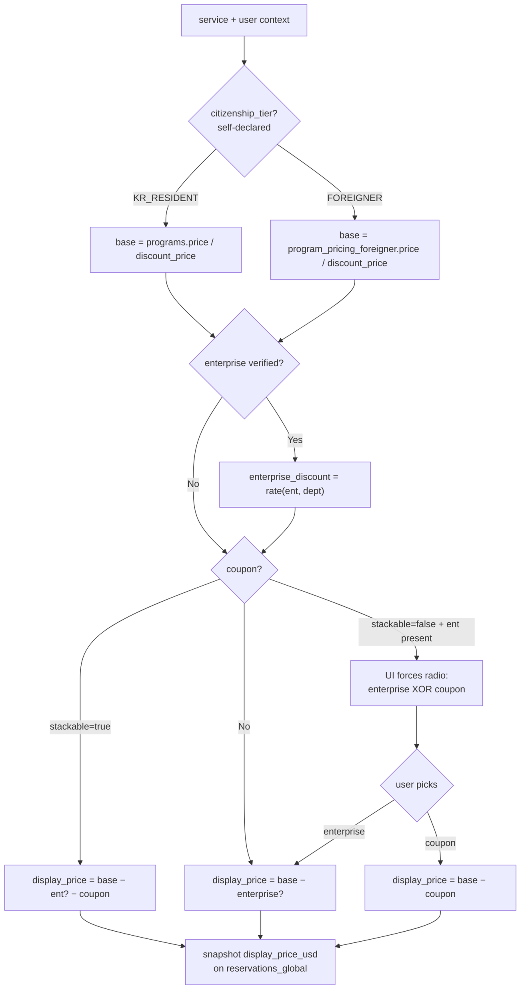

# Design Brief — Safedoc Global Service (2026-05-15 Demo)
# 시각화 브리프 — Safedoc 글로벌 서비스 (5/15 데모)

**Source of truth:** `.pm/product-brief.md`, `.pm/sprints/S0/plan.md`, `.pm/risk-register.md`, `.pm/korean-data-mapping.md`, `.pm/raci.md`, `.pm/legal/hipaa-position.md`
**Purpose of this file:** input to a downstream visualization pass (`claude design`). Each section below carries (a) the facts to render, (b) a suggested visual form, (c) source citations. This brief does not decide anything new — it consolidates what is already decided and flags what is still open.
**For design decisions (tokens, typography, components, a11y):** see `.pm/design-guide.md`. This file is a *visualization* brief; the *design system* lives there. The one-paragraph rendering hints in §14 below are superseded by `design-guide.md` and kept only for historical reference.
**Last updated:** 2026-05-12 (v2 visual direction added — supersedes select v1 sections; see §0a below)

---

## 0a. v2 visual direction (2026-05-12) — RealSelf-inspired trust platform / v2 시각 방향성

> **Scope of override.** This section restates the *current* visualization direction for the 5/15 demo surface. Where it conflicts with anything below, this section wins. Sections it materially supersedes: §4 (screen inventory — extended), §14 (rendering hints — palette + page list). For the design-system implications (tokens, components, page hierarchy, content hierarchy), see `design-guide.md` §0a.

**Reference, not template:** RealSelf is used as a structural reference for *patterns* — black-and-white monochrome canvas, procedure-first discovery, review and before/after content hierarchy, educational article-driven conversion, clean cards/filters/search-first UX. We do **not** copy RealSelf brand assets, tone, illustrations, photography, or layout.

**What changes from v1 (April 21):**

1. **Palette pivot — monochrome trust.** Pure white canvas, true black ink, warm-tinted neutral grays. SAFE BLUE shrinks to brand anchor only (logo, focus ring, in-text link). LIME re-enters the UI in one narrow role (verification check). AQUA and PURPLE remain quarantined. No mesh, no glassmorphism, no per-specialty colored cards.
2. **Discovery starts from procedure, not department.** "Department selector → hospital list" is preserved in the booking flow, but the front door of the product becomes a procedure-search experience.
3. **Reviews + before/after are first-class content.** Both were on the v1 ban list (or hidden behind Open Q7). They are now required surfaces, gated on real consent and authenticity controls (see `design-guide.md` §11).
4. **Educational guides become a content vertical.** Long-form articles are first-class objects that link to procedure pages, provider pages, and the booking flow.
5. **Concierge is surfaced as a sticky trust module**, not buried in the footer — translation, booking coordination, travel logistics, follow-up support.
6. **No hospital-brochure feel.** Reads like a credible US consumer healthcare discovery platform. Calm, spacious, photo-driven, review-driven, evidence-driven.

**What does not change:** product scope (`product-brief.md`), data ownership split (§6 of this brief), pricing engine (§5), bilingual rules, PII posture (§6.3), accessibility floor (`design-guide.md` §12), out-of-scope fence (§12), risk register, sprint plan dates.

---

## 1. One-liner & positioning / 한 줄 소개 및 포지셔닝

**Render as:** hero card split into "What it is" (positive) vs "What it is NOT" (negative), plus a three-node positioning triangle.

**One-liner (EN):** A bilingual (EN/KO) web platform that lets US-resident users discover Safedoc-contracted Korean hospitals by medical department, see pricing tailored to their citizenship and corporate affiliation, and submit booking requests — with opt-in add-on services (lodging, flights, tours) handled by Safedoc CS.

**What it IS:**
- Cross-border elective-care booking platform.
- Responsive web (Next.js App Router, desktop + mobile browsers).
- EN/KO bilingual, citizenship-aware pricing, enterprise-discount aware.

**What it is NOT:**
- Not an EHR. Not telehealth. Not a clinical record system.
- Not a payment processor for the 5/15 demo (Stripe deferred to Phase 2).
- Not a native mobile app. Not a Kakao/Naver login surface.

**Positioning triangle:** US user ↔ Safedoc (global service) ↔ Korean hospital.

Sources: `product-brief.md` L11-16, L60-78.

---

## 2. User segments × pricing tier / 사용자 세그먼트 × 요금 체계

**Render as:** 3×2 matrix (segment × account type). Cells color-coded by tier outcome. Legend flags self-declared citizenship with a small warning chip (R-014).

| Segment | Individual | Enterprise-affiliated |
|---|---|---|
| Western US resident (US citizen) | `FOREIGNER` rate | `FOREIGNER` − enterprise discount |
| Korean-American w/ KR citizenship | `KR_RESIDENT` rate | `KR_RESIDENT` − enterprise discount |
| Korean-American w/o KR citizenship | `FOREIGNER` rate | `FOREIGNER` − enterprise discount |

Caveats to render as footnotes:
- Citizenship is **self-declared** at sign-up; no document verification in v1 (R-014).
- One user → one enterprise. Admin verifies enterprise code; user sees pending tier meanwhile.
- Coupon path overlays on top of the matrix — see Section 5.

Sources: `product-brief.md` L21-32, L87-90; `risk-register.md` R-014.

---

## 3. Five core flows / 5가지 핵심 플로우

**Render as:** five stacked swim-lane diagrams. Consistent lane order: `User | Next.js BFF | Korean API | Korean Admin | Safedoc CS`. Solid arrows = in-app. Dashed arrows = out-of-band / manual.

### Flow 1 — Sign-up
Land (EN/KO) → browse as guest → click "Book" / "See my rate" → Google/Apple OAuth → one-time profile (citizenship, enterprise code?, email) → enterprise code marked "pending verification" if entered.

### Flow 2 — Browse & find
Home → department selector → hospital list (department filter, tier-adjusted price) → hospital detail → service selection.

### Flow 3 — Book
Service selected → booking form (name, phone, age, gender, department, desired date, **passport**, nationality, email, Korea entry/exit dates; optional hotel, flight, notes; add-on checkboxes) → price summary (tier → enterprise discount? → coupon?) → submit → `WAITING` state. **5/15 demo stops here.**

### Flow 4 — Hospital confirms (out-of-band)
Hospital sees request in Korean admin → accepts/declines/proposes alternate → user sees `CONFIRMED` or notified.

### Flow 5 — CS add-on (out-of-band)
Bookings with add-ons enter CS queue in Korean admin → CS consults via Slack + email/platform message → notes logged against booking.

Sources: `product-brief.md` L82-114; `korean-data-mapping.md` §8-1 (`reservation_status = WAITING`).

---

## 4. Screen inventory / 화면 인벤토리

**Render as:** 3×3 thumbnail grid. Each tile: screen name (EN + KO) · route · primary CTA · Sprint-0 backlog ID.

### 4.1 Sprint 0 / S1 demo screens (booking surface)

| # | Screen | Route | Primary CTA | Backlog |
|---|---|---|---|---|
| 1 | Landing / 랜딩 | `/` | "Find a procedure" | S0-07 |
| 2 | Department list / 진료과 선택 | `/departments` | "See hospitals" | S0-07 |
| 3 | Hospital list / 병원 목록 | `/hospitals?department={id}` | "View hospital" | S0-08 |
| 4 | Hospital detail / 병원 상세 | `/hospitals/[id]` | "Book service" | S0-09 |
| 5 | Booking form / 예약 폼 | `/bookings/new` | "Submit request" | S0-10 |
| 6 | Booking status / 예약 상태 | `/bookings/[id]` | (status pill) | S0-S1 (stretch) |
| 7 | Sign-in prompt / 로그인 안내 | interstitial | "Continue with Google / Apple" | S0-05 |
| 8 | Loading state / 로딩 | n/a | — | S0-08, S0-09 |
| 9 | Empty state / 빈 상태 | n/a | "Change department" | S0-08 |

### 4.2 v2 discovery and content surfaces (added 2026-05-12)

Render as: 4×3 thumbnail grid. Each tile includes the same fields as §4.1 plus a content-source column (Korean API / Global CMS / hybrid). All v2 screens depend on Sprint-1 content-modeling work; for the 5/15 demo they ship with seeded fixture data, not live Korean-API content.

| # | Screen | Route | Primary CTA | Content source |
|---|---|---|---|---|
| 10 | Procedures index / 시술·진료 항목 | `/procedures` | "See procedure" | Global CMS (procedure catalog) |
| 11 | Procedure detail / 시술 상세 | `/procedures/[slug]` | "Get matched with a clinic" | Global CMS + Korean API (hospitals, programs) |
| 12 | Reviews index / 리뷰 | `/reviews` | "Read review" | Global CMS (reviews + verification flags) |
| 13 | Review detail / 리뷰 상세 | `/reviews/[id]` | "View provider" | Global CMS |
| 14 | Before/After gallery / 비포·애프터 | `/before-after` | "View case" | Global CMS (cases + consent records) |
| 15 | Before/After case / 케이스 상세 | `/before-after/[caseId]` | "Talk to concierge" | Global CMS |
| 16 | Guides index / 가이드 | `/guides` | "Read guide" | Global CMS (articles) |
| 17 | Guide article / 가이드 상세 | `/guides/[slug]` | "Get matched with a clinic" | Global CMS |
| 18 | Provider directory / 병원 디렉토리 | `/providers` | "View provider" | Korean API (hospitals) |
| 19 | Provider detail / 병원 프로필 | `/providers/[id]` | "Request consultation" | Korean API + Global CMS (provider's reviews, before/after, guides) |
| 20 | Concierge module / 컨시어지 안내 | `/concierge` | "Talk to a concierge" | Global CMS (static) |

Notes:
- `Hospital detail` (#4) and `Provider detail` (#19) refer to the same data entity; #19 is the richer v2 surface, #4 is the leaner booking-flow surface. Pick one canonical route in Sprint 1 (recommend `/providers/[id]` and 301-redirect `/hospitals/[id]`).
- All v2 review and before/after surfaces require a **consent + authenticity disclosure banner** (see `design-guide.md` §11). Demo fixtures must include the disclosure even when content is seeded.

Sources: `sprints/S0/plan.md` L37-45, L51; this brief §0a.

---

## 5. Pricing engine / 가격 엔진

**Render as:** left = formula block, center = decision tree (diamonds for branches), right = three worked-example cards (one persona per tier).

**Formula:**
```
display_price(service, user) =
  base_price(service, citizenship_tier)
    [KR_RESIDENT → programs.price / discount_price]
    [FOREIGNER   → program_pricing_foreigner.price / discount_price]
  - enterprise_discount(user.enterprise, service.department)?
  - coupon_discount(user.coupon)?
```

**Decision flow (mermaid — visualizer may rerender):**


Implementation: pure TS module `lib/pricing.ts`, 80% unit coverage across (tier) × (enterprise present/absent) × (stackable/non-stackable coupon) — S0-11 exit criteria. Deposit-vs-full decision is per-hospital in admin; grayed out for the 5/15 demo.

Sources: `product-brief.md` L117-131; `sprints/S0/plan.md` S0-11; `korean-data-mapping.md` §5-3, §10.

---

## 6. Korean API integration map / 한국 API 통합 지도

**Render as:** (a) classification legend chips · (b) two-column diagram — Korean DB (with READ/WRITE/EXTEND badges) on the left, Global-only DB on the right · (c) red-hatched bottom strip of excluded tables · (d) callout box for three P0 architect decisions.

### 6.1 Endpoint matrix

| Endpoint | Dir. | Sprint | 5/15 status | i18n? | PII | Needs extension |
|---|---|---|---|---|---|---|
| `GET /departments` | READ | S0 | mock → real in S1 | Yes (`name`) | — | `global_visible`, `global_order_no` |
| `GET /treatments` | READ | S0 | mock → real in S1 | Yes (`name`) | — | — |
| `GET /treatments-sub` | READ | S0 | mock → real in S1 | Yes (`name`) | — | — |
| `GET /hospitals` | READ | S0 (S0-03, S0-08) | mock → real in S1 | Yes (name, transport, introduce, notice, landmark, address) | — | `global_is_published`, `global_is_new`, `global_has_event`, `foreigner_friendly` |
| `GET /hospitals/{id}` | READ | S0 (S0-09) | mock → real in S1 | Yes (+ `detail_content`, `working_times_description`) | — | same as list |
| `GET /programs` | READ | S0 | mock → real in S1 | Yes (name, composition, additional_info) | — | `foreigner_price`, `foreigner_discount_price`, `global_visible` |
| `POST /reservations` | WRITE | S0 contract → S1 submit | mock S0, real S1 | EN snapshot | **Strong PII — passport** | `reservations_global` sibling payload |
| `GET /reservations/{id}` | READ | S1 | not S0 scope | snapshot-only | low | — |

### 6.2 Ownership split

| Korean DB owns (READ) | Korean DB extended for Global (EXTEND) | Global-only DB (GLOBAL_ONLY) |
|---|---|---|
| `departments`, `treatments`, `treatments_sub` (masters) | `hospitals.global_is_published / global_is_new / global_has_event / foreigner_friendly` | `global_users` (OAuth sub, citizenship, preferred_language, enterprise_id) |
| `hospitals` (name, address, working_times, images, contract_state) | `programs.foreigner_price / foreigner_discount_price` — recommended as `program_pricing_foreigner` side table (Open Q2) | `enterprises`, `enterprise_discounts` |
| `programs` (KR price, tax_type, composition, status) | `reservations_global` sibling (passport encrypted, nationality, email, entry/exit, addons, pricing_tier, applied_enterprise_id, applied_coupon_id, display_price_usd, display_language) — Open Q3 | `coupons`, `coupon_redemptions` |
| `programs_detail_template`, `treatments_sub_template` (content fallback) | `reservations.inflow_type` — new enum `GLOBAL` (Open Q10) | `addon_consultations` (reservation_id, type, notes, CS assignment) |
| `reservations` core (member_id, status, wished_date, name snapshots) | i18n jsonb columns on user-facing text (Option B) | OAuth session, language preference |

**Never exposed to Global API:** `bank_name`, `account_number`, `memo`, `notification_setting`, `check_list`, `livelihood_support`, `treatment_histories*` (PHI risk), `treatment_payment_history`, `program_inspection*`. Sources: `korean-data-mapping.md` §4-2, §9.

### 6.3 PII posture
Passport = strong PII, column-level envelope encryption required; cross-border transfer consent required at sign-up. Risk IDs: **R-006** (log/analytics leakage), **R-016** (passport handling), **R-017** (cross-border transfer). See `legal/hipaa-position.md`.

Sources: `korean-data-mapping.md` §1-10, §12; `sprints/S0/plan.md` S0-03/S0-04.

---

## 7. i18n scope / 다국어 범위

**Render as:** left = recommendation callout with pro/con table, right = translation-field checklist grouped by Korean table with KO/EN flag pairs.

### 7.1 Storage decision (Option B — jsonb)

| Option | Structure | Pros | Cons | Decision |
|---|---|---|---|---|
| A | `<table>_translations(entity_id, locale, field, value)` | Normalized; easy 3rd-language add | Many JOINs; rewrites Korean queries | Rejected |
| **B (RECOMMENDED)** | `name_i18n jsonb` = `{"ko": "...", "en": "..."}` | Minimal schema churn; Korean queries survive; ships for 5/15 | Indexed search on translated text awkward | **Accepted (pending architect sign-off)** |
| C | Parallel `name`, `name_en` columns | Simplest read path | Schema change repeats per new locale | Rejected |

**Fallback rule:** if `name_i18n.en` missing → render `name_i18n.ko` with an "original Korean" badge.

### 7.2 i18n target fields

```
departments              : name
treatments               : name
treatments_sub           : name
hospitals                : name, transport, introduce, notice,
                           working_times_description, nearby_landmark,
                           detail_content, address (subset)
programs                 : name, composition, additional_info
programs_detail_template : title, content
treatments_sub_template  : title, content
(deferred)               : label master, event banners, push templates
```

**Not i18n:** numeric `working_times` / `lunch_time`, coordinates, timestamps, image URLs. **But:** image-embedded Korean text requires a parallel EN asset upload (Open Q9).

Sources: `korean-data-mapping.md` §11; `product-brief.md` L49-50; `sprints/S0/plan.md` S0-06.

---

## 8. Timeline / 타임라인

**Render as:** horizontal Gantt ribbon with two sprint bands stacked; milestone pins; red-flag icon on 2026-04-23 (Korean team must be engaged).

| Date | Milestone |
|---|---|
| 2026-04-21 | Product brief confirmed (today) |
| 2026-04-22 → 05-01 | **Sprint 0** — 8 working days · 14 committed items (S0-01 … S0-14) |
| 2026-04-23 | Korean eng team engaged (hard dependency — R-013) |
| 2026-04-25 | First weekly risk review |
| 2026-05-04 → 05-15 | **Sprint 1** — 10 days |
| 2026-05-08 | Feature freeze |
| 2026-05-13 | Demo dry-run with pilot hospitals |
| 2026-05-15 | **Demo day** |

Sprint 0 committed set (abbreviated): scaffold (S0-01), CI + staging (S0-02), Korean OpenAPI contract (S0-03), mock server (S0-04), OAuth (S0-05), i18n scaffold (S0-06), landing (S0-07), hospital list (S0-08), hospital detail (S0-09), booking form + validation (S0-10), pricing engine unit-tested (S0-11), HIPAA posture v1 + legal engagement (S0-12), Korean admin change request (S0-13), risk register cadence (S0-14).

Sources: `product-brief.md` L215-220; `sprints/S0/plan.md` L1-13, L30-45, L72, L109-121.

---

## 9. Risk heat map / 리스크 히트맵

**Render as:** severity × category grid. Each risk as a pill inside its cell with the risk ID. Legend at bottom: blocker / must fix / monitor / log only.

**Excluded:** R-002, R-003 (marked accepted / out of scope — EHR scope is gone).

| Severity ↓ / Category → | Regulatory | Execution | App security | Operations | Fraud |
|---|---|---|---|---|---|
| **CRITICAL** | — | — | **R-006** (PHI-like log leakage), **R-007** (IDOR) | — | — |
| **HIGH** | **R-001** (posture sign-off), **R-015** (TX HB 300) | **R-012** (5/15 timeline), **R-013** (Korean API critical path), **R-018** (Korean admin extension) | **R-008** (credential stuffing), **R-009** (supply chain), **R-010** (SSRF), **R-016** (passport PII) | — | — |
| **MEDIUM** | **R-017** (cross-border transfer) | **R-004** (skill split), **R-005** (EHR scope creep), **R-019** (hospital demo readiness) | — | **R-011** (PM routing SPoF) | **R-014** (citizenship fraud) |

**Demo-day focus four:** R-012, R-013, R-016, R-018.

Sources: `risk-register.md` L11-161.

---

## 10. Roles & dependencies / 역할 및 의존성

**Render as:** compact workstream × team grid with R/A/C/I badges. Put a red border around the Korean eng column to call out external-dependency risk.

| Workstream | Human PM | US eng | Korean eng | CS | Legal |
|---|---|---|---|---|---|
| Product / planning | A | C | C | I | — |
| Korean API contract | A | C | **R** | — | — |
| Korean admin extension | A | I | **R** | C | — |
| Frontend (Next.js) | I | **R** | — | — | — |
| Auth (Google/Apple) | I | **R** | — | — | — |
| i18n | I | **R** | C | — | — |
| Pricing logic | A | **R** | C | — | — |
| Booking form + PII | A | **R** | C | — | — |
| Add-on → CS queue | I | **R** | C | C | — |
| CS add-on operation | I | — | — | **R** | — |
| Security + privacy posture | A | C | C | — | **R** |
| Legal posture sign-off | A | — | — | — | **R** |

**Hard external dependencies:** Korean API contract (R-013), Korean admin extension (R-018), legal posture sign-off (R-001). All three ride on the 3.5-week window.

Sources: `raci.md` L8-16, L19-36, L48-53.

---

## 11. Legal posture snapshot / 법률 포지션 요약

**Render as:** 4-quadrant card (one per regime) with color-coded applicability verdict; bottom strip = "Option C — belt-and-suspenders" banner.

| Regime | Applicability to this product | Status |
|---|---|---|
| **HIPAA (US federal)** | Likely not a covered entity or BA — no US healthcare provider in the flow | Draft posture favors non-HIPAA |
| **Texas HB 300** | Likely applies if TX LLC handles health-adjacent data — broader than HIPAA | Controls baseline required |
| **CCPA / CPRA** | Conditional — depends on CA resident share + revenue thresholds | Treat as applicable by default |
| **Korea PIPA** | Applies to outbound leg (US → Korean API) — cross-border consent + DPA required | Consent wording in sign-up flow |

**Recommended posture:** Option C — non-HIPAA consumer + proactive TX HB 300 + CCPA/CPRA-equivalent + PIPA cross-border. See `.pm/legal/hipaa-position.md` (44k — do not inline). Breakdown: 10 engineering controls + 10 legal/contractual items + 7 open legal questions pending counsel sign-off.

Sources: `legal/hipaa-position.md` §TL;DR; `risk-register.md` R-001; `product-brief.md` L243.

---

## 12. Out-of-scope fence / 명시적 제외 범위

**Render as:** two-column strip — left = Phase 2 (amber), right = permanently out of scope (red). Each item as a struck-through chip.

**Deferred to Phase 2:**
- Stripe payment (USD) · Flutter Web · Native iOS/Android · Kakao/Naver login · Email-password auth · Cancellation/refund processing · Document verification of citizenship · Hospital self-serve portal · In-app chat/video · Non-USD currencies · Real-time slot availability · Calendar sync.

**Permanently out of scope (through v1):**
- EHR integration · SMART-on-FHIR · CCDA intake · OCR of medical documents · Clinical decision support · LLM clinical summarization · Any storage of medical history, diagnoses, prescriptions, or test results.

Sources: `product-brief.md` L60-78; `sprints/S0/plan.md` L57-67.

---

## 13. Open architecture decisions / 미결 아키텍처 이슈

**Render as:** priority-tagged list (P0 red, P1 amber, P2 gray). P0 items must resolve before S0-03 (OpenAPI contract sign-off) is `done`.

| # | Priority | Question | One-line recommendation |
|---|---|---|---|
| 1 | P0 | User ID namespace: share Korean `members` or separate? | Separate Global ID; `korean_member_id` nullable mapping on `global_users` |
| 2 | P0 | Foreigner pricing: extend `programs` vs `program_pricing_foreigner` side table | Side table — USD-next-to-KRW; keeps Korean schema clean |
| 3 | P0 | Global reservation extension: extend `reservations` vs `reservations_global` | Side table — PII isolation + encryption scope |
| 4 | P0 | Passport number encryption | App-layer envelope encryption (KMS); never plaintext in Korean DB |
| 5 | P0 | i18n structure | Option B (`name_i18n` jsonb) |
| 6 | P1 | Global visibility flag: Korean column vs Global whitelist | Korean column — avoids sync drift (S0-13 ask) |
| 7 | P1 | Share Korean `star_rating` / `review_count` on Global? | Yes for 5/15; revisit post-launch |
| 8 | P1 | `hospitals.address` bilingual structure | jsonb parallel `{"ko": {...}, "en": {...}}` |
| 9 | P1 | Image-embedded Korean text | Parallel EN asset + locale-aware select |
| 10 | P0 | `inflow_type` enum — add `GLOBAL`? | Yes; required on S1 day 1 for booking attribution |
| 11 | P1 | Price snapshot currency | Store both (`display_price_usd`, `display_price_krw`, `fx_rate_at_booking`) |

Sources: `korean-data-mapping.md` §12.

---

## 14. Rendering hints for `claude design` / 시각화 툴 힌트

- **Palette (suggested for PM artifacts only — internal diagrams, NOT the product UI):** neutral graphite base; one accent for `KR_RESIDENT` tier; a contrasting accent for `FOREIGNER` tier; amber for Phase-2; red for permanently-out-of-scope + CRITICAL risks. Avoid medical-red. The *product surface* uses a stricter v2 monochrome palette (white + true black + warm gray + tiny SAFE BLUE accent + narrow LIME verification accent) — see `design-guide.md` §0a / §3.
- **Typography:** bilingual — a Latin face + a KR face that share an x-height. Avoid pairing where Korean looks visually smaller.
- **Diagram style:** flat, no skeuomorphism; rounded-rect boxes; dashed arrows = out-of-band / manual; solid arrows = in-app.
- **One page per section** when rendering as slides; one continuous scroll when rendering as a document.
- **Do not add** hypothetical screens, hypothetical entities, or decorative hospital iconography that implies clinical delivery. The product is a coordinator, not a provider.
- **Do not render** dates past 2026-05-15 as commitments — Phase 2 is a placeholder.

---

## Change log

- 2026-04-21 — Initial brief assembled from planner + architect agent inputs. Merges `product-brief.md`, `sprints/S0/plan.md`, `risk-register.md`, `korean-data-mapping.md`, `raci.md`, `legal/hipaa-position.md` (TL;DR only).
